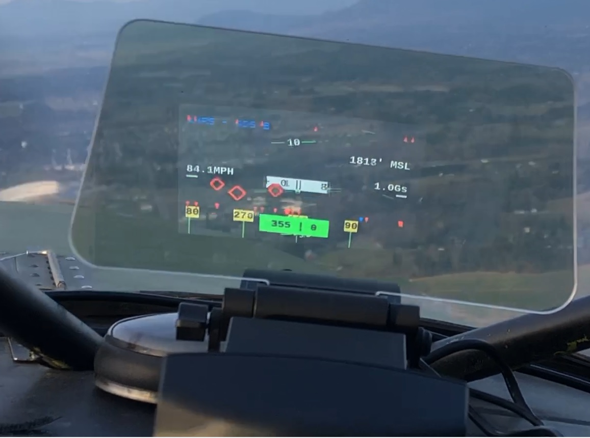
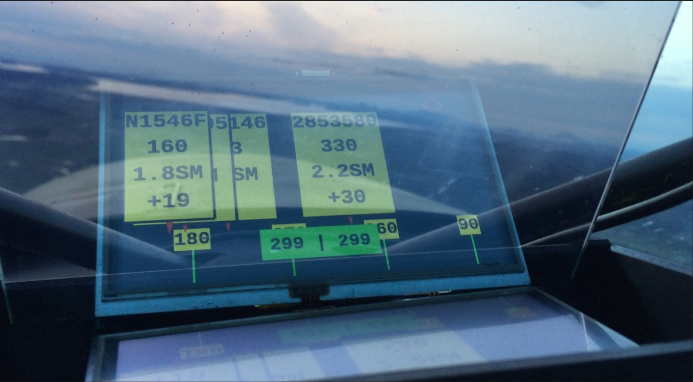
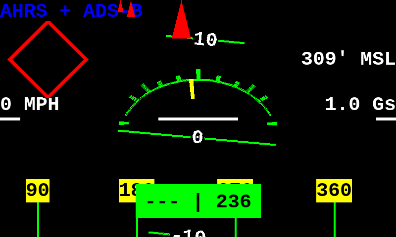
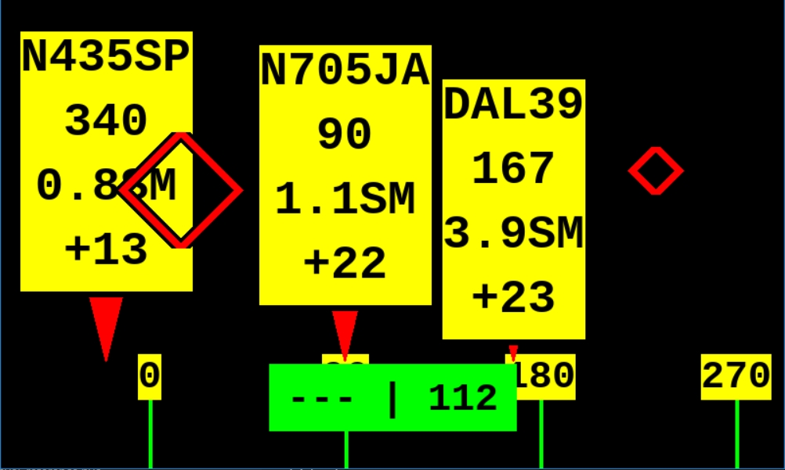
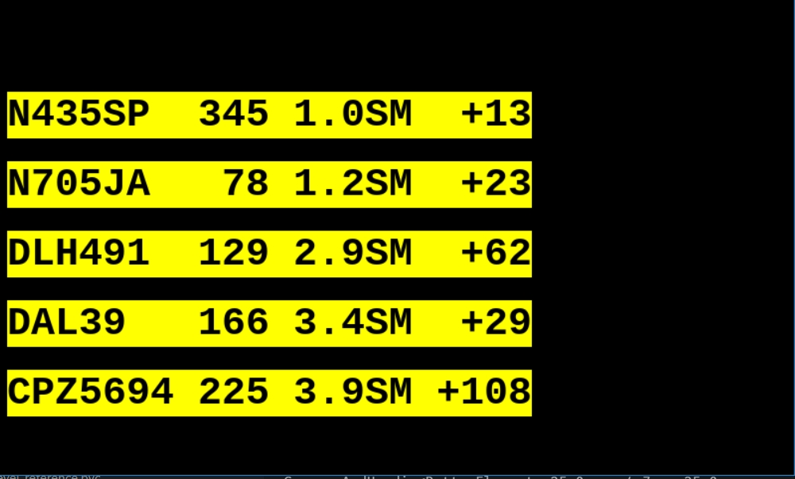
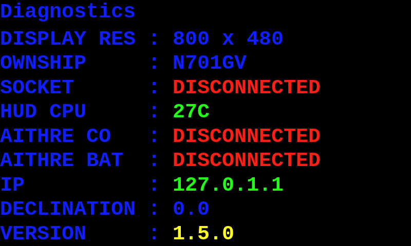
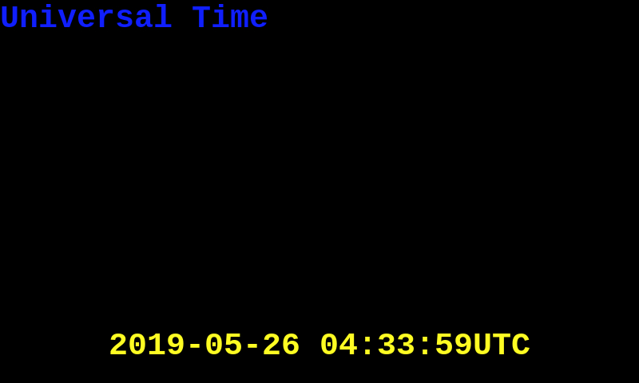
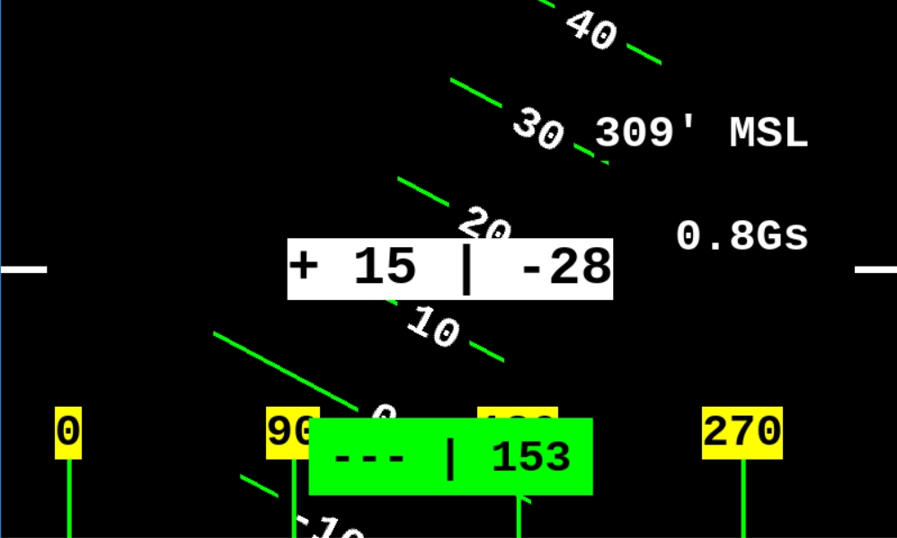

# STRATUX HUD 

## Table Of Contents

<!-- vscode-markdown-toc -->
* 1. [Introduction](#Introduction)
	* 1.1. [Recommended](#Recommended)
	* 1.2. [Alternative, Less Expensive Version](#AlternativeLessExpensiveVersion)
* 2. [In Flight Controls](#InFlightControls)
* 3. [Included (Default) Views](#IncludedDefaultViews)
	* 3.1. [AHRS + ADS-B View](#AHRSADS-BView)
	* 3.2. [Traffic View](#TrafficView)
	* 3.3. [Traffic Listing View](#TrafficListingView)
	* 3.4. [Diagnostics View](#DiagnosticsView)
	* 3.5. [Universal Time](#UniversalTime)
	* 3.6. [Blank](#Blank)
	* 3.7. [AHRS View](#AHRSView)
* 4. [Parts List](#PartsList)
	* 4.1. [All Builds](#AllBuilds)
	* 4.2. [Recommended Kivic Build](#RecommendedKivicBuild)
	* 4.3. [3D Print Build](#DPrintBuild)
* 5. [Recommended Software Install](#RecommendedSoftwareInstall)
* 6. [Development/From Scratch Install instructions](#DevelopmentFromScratchInstallinstructions)
	* 6.1. [First Boot](#FirstBoot)
		* 6.1.1. [Raspberry Pi 3B+](#RaspberryPi3B)
	* 6.2. [Install Software](#InstallSoftware)
		* 6.2.1. [Developer Note](#DeveloperNote)
	* 6.3. [Ownship](#Ownship)
	* 6.4. [Aithre Support](#AithreSupport)
		* 6.4.1. [BlueTooth for AIO Setups](#BlueToothforAIOSetups)
	* 6.5. [Kivic Based Setup](#KivicBasedSetup)
	* 6.6. [Teleprompter Glass Based Setup](#TeleprompterGlassBasedSetup)
* 7. [Appendix](#Appendix)
	* 7.1. [Updating StratuxHud Code](#UpdatingStratuxHudCode)
	* 7.2. [Barrel Jack Connector (Raspberry Pi 3 only _**NOT 3B+**_)](#BarrelJackConnectorRaspberryPi3only_NOT3B_)
	* 7.3. [Revision History](#RevisionHistory)
	* 7.4. [Hardware Performance](#HardwarePerformance)
* 8. [Acknowledgements And Credits](#AcknowledgementsAndCredits)
* 9. [License](#License)

<!-- vscode-markdown-toc-config
	numbering=true
	autoSave=true
	/vscode-markdown-toc-config -->
<!-- /vscode-markdown-toc -->


##  1. <a name='Introduction'></a>Introduction

This project aims to bring an affordable heads up display system into ANY cockpit.

The focus is to improve traffic awareness and to reduce the amount of time pilots reference tablets or an EFB.

**NOTE:** This project relies on having a [Stratux](http://stratux.me/) build with AHRS and GPS. A suitable build can be done for less than $150 (USD).

There are two versions that can be built:

###  1.1. <a name='Recommended'></a>Recommended

Using the "Kivic HUD 2nd Gen" projector and a Raspberry Pi 3.



Estimated cost is $270

- $40 for RaspberryPi 3
- $195 for Kivic 2nd Gen projector
- Fans, case, cables

Uses 5V USB power.

**NOTE:** This project initially used and recommended the "HUDLY Classic" projector which is no longer available.

**NOTE:** To have full functionality with a Stratux based unit, please use Stratux Version 1.4R5 or higher.

###  1.2. <a name='AlternativeLessExpensiveVersion'></a>Alternative, Less Expensive Version

A self contained system that uses a 3D printed case and teleprompter glass. This version can be built for the cost of a Raspberry Pi and the 3D print.

_NOTE:_ This version does have visibility issues in daylight conditions. Using an automotive HUD projector will result in full daylight visibility.



Estimated Cost is $140

- $40 for a RaspberryPi 3
- $45 for the LCD screen
- $20 for Teleprompter Glass and shipping.
- Cost of 3D printing the special case.
- Cables

Can be powered by a USB powerbank or USB power.

##  2. <a name='InFlightControls'></a>In Flight Controls

You may use a number pad as input device. I used velcro to secure the number pad to my dashboard.

Key       | Action
--------- | ----------------------------------------------------------------------------
Backspace | Tell the Stratux that you are in a level position. Resets the AHRS to level.
+         | Next view
-         | Previous view
=         | Toggle rendering debug information
Esc       | Send shutdown commands to both the HUD controller **and** the Stratux
q         | (_Full keyboard only_) Quit to the command line.
0/Ins     | Force a connection reset between the HUD and the Stratux

##  3. <a name='IncludedDefaultViews'></a>Included (Default) Views

- AHRS + ADS-B
- Traffic
- Traffic List
- Universal Time
- Diagnostics
- (Blank)
- AHRS Only

###  3.1. <a name='AHRSADS-BView'></a>AHRS + ADS-B View



This view shows attitude information along with targeting bugs that show the relative position and distance of traffic.

In this example:

- There are three (3) potential targets, all at a higher altitude. Two are relatively far away, one is closer.
- One of the targets is within our field of view and has a targeting reticle.
- With are rolled to the left slightly, less then 15 degrees.
- We are 309 feet MSL.
- We are stopped, with a groundspeed of 0MPH
- We have a GPS heading of 236, but do not have enough forward speed to obtain a heading from the AHRS chip. If the AHRS chip is unable to produce a reliable heading, `---` is shown for that portion of the heading.

_NOTE:_ This is the default view on startup. If you would like to switch to the `AHRS Only` You may press `-` on the keypad.

###  3.2. <a name='TrafficView'></a>Traffic View



This view shows a heading strip, target bugs, targeting reticles, and "information cards" about our potential traffic.

In this example, `N2849K` is almost directly behind us (far left screen). The plane is 1.5 statute miles away, with a bearing of 70 degrees, and 100 feet above us.

###  3.3. <a name='TrafficListingView'></a>Traffic Listing View



This shows us _at most_ the eight closest planes.

The _IDENT_ifier will be the tail number when available, otherwise the ICAO identifier or callsign may be used. The _BEAR_ing is the heading to take to fly to that target. The _DIST_ance is the distance to the target. The _ALT_itude is given in relative terms, with two digits dropped.

In this example, the closest target is N1213S. The plane is only 1.2 statue mile away, and 1,500 feet above us.

###  3.4. <a name='DiagnosticsView'></a>Diagnostics View



The diagnostics view is designed to help give some troubleshooting ability. If a value is set for "OWNSHIP" (See the configuration file section), then any report from that tailnumber is ignored. The IP address is provided so you may use the configuration webpage if you set it up.

###  3.5. <a name='UniversalTime'></a>Universal Time



Shows the current time in UTC at the bottom of the screen.

###  3.6. <a name='Blank'></a>Blank

A blank screen so no information is displayed.

###  3.7. <a name='AHRSView'></a>AHRS View



This is a similar view to `AHRS + ADS-B`, but removes any AHRS information.

##  4. <a name='PartsList'></a>Parts List

###  4.1. <a name='AllBuilds'></a>All Builds

_NOTE:_ This _does not_ include a power source. You will need to supply ship power from a 5V USB port or from a battery.

- [Raspberry Pi 3](https://www.amazon.com/Raspberry-Pi-RASPBERRYPI3-MODB-1GB-Model-Motherboard/dp/B01CD5VC92/ref=sr_1_3?s=electronics&ie=UTF8&qid=1529215701&sr=1-3&keywords=raspberry+pi+3)
- [Case For Raspberry Pi](https://www.amazon.com/iPhoenix-Raspberry-White-Compatible-Model/dp/B06XQSXZ97/ref=sr_1_3?s=electronics&dd=iYEspjjyeRXfqDW9BHwJFw%2C%2C&ddc_refnmnt=pfod&ie=UTF8&qid=1529215794&sr=1-3&keywords=white+raspberry+pi+3+case&refinements=p_97%3A11292772011)
- [Cooling Fan for Raspberry Pi](https://www.amazon.com/gp/product/B075R4S9GH/ref=od_aui_detailpages00?ie=UTF8&psc=1)
- [Micro USB Cable](https://www.amazon.com/AmazonBasics-Male-Micro-Cable-Black/dp/B0711PVX6Z/ref=sr_1_6?s=electronics&ie=UTF8&qid=1529215888&sr=1-6&keywords=micro+usb+cable)
- [Micro SD Card](https://www.amazon.com/SanDisk-Ultra-Micro-Adapter-SDSQUNC-016G-GN6MA/dp/B010Q57SEE/ref=sr_1_10?s=pc&ie=UTF8&qid=1529215944&sr=1-10&keywords=micro+sd+card)
- [Rottay Mechanical Keypad](https://www.amazon.com/Number-Rottay-Mechanical-Numeric-backlit/dp/B076FTSY6J/ref=sr_1_3?ie=UTF8&qid=1529215627&sr=8-3&keywords=mechanical+keypad)

###  4.2. <a name='RecommendedKivicBuild'></a>Recommended Kivic Build

- [Kiviv HUD 2nd Gen](https://www.amazon.com/gp/product/B078GHFMG5/ref=ppx_yo_dt_b_asin_title_o01__o00_s00?ie=UTF8&psc=1)
- [6' 3.5mm Analog Cable](https://www.amazon.com/gp/product/B074TDHRCC/ref=ppx_yo_dt_b_asin_title_o00_s01?ie=UTF8&psc=1)
- [_OPTIONAL_ 3/4" Wire Braiding](https://www.amazon.com/gp/product/B073YL3HMC/ref=ppx_yo_dt_b_asin_title_o00_s01?ie=UTF8&psc=1)

###  4.3. <a name='DPrintBuild'></a>3D Print Build

- [Teleprompter Glass Sample of both thickness of the 60/40 glass](https://telepromptermirror.com/sample/)
- [SunFounder 5" TFT LCD](https://www.amazon.com/SunFounder-Monitor-Display-800X480-Raspberry/dp/B01HXSFIH6)

##  5. <a name='RecommendedSoftwareInstall'></a>Recommended Software Install

Please use one of the provided images from the "Release" page on GitHub.

1. Download the image for your scenario from the GitHub (Releases Page)[<https://github.com/JohnMarzulli/StratuxHud/releases>]
2. Use (Etcher)[<https://www.balena.io/etcher/>] to flash the image onto an Micro SD card.
3. Plug in your Projector to the Raspberry Pi
4. It is recommended that you SSH into the HUD and use `raspi-config` to ("expand the filesystem")[<https://geek-university.com/raspberry-pi/expand-raspbian-filesystem/>].

##  6. <a name='DevelopmentFromScratchInstallinstructions'></a>Development/From Scratch Install instructions

###  6.1. <a name='FirstBoot'></a>First Boot

1. Flash the latest [Raspbian](https://www.raspberrypi.org/downloads/raspbian/) to an SD card
2. Plug in a keyboard and a monitor
3. Plug in the power to the Pi.
4. Press ctrl+alt+f1 to quit from the GUI to the desktop
5. `sudo raspi-config`
6. `Boot Options` -> `Desktop / CLI` -> `Console Autologin`
7. `Advanced Options` -> `Expand Filesystem`
8. `Advanced Options` -> `Memory Split` -> "128"
9. "OK"
10. "Finish"
11. "Yes"
12. Wait for the reboot
13. `sudo raspi-config`
14. "Network options" -> "WiFi"
15. Choose your country. Pressing "u" will take you to USA.
16. Enter your network name and password.
17. "Interfacing Options" -> "Enable SSH"
18. "Localization" -> "Change Keyboard Layout" -> "Generic 104"
19. "Other" -> "English US" -> "Default" -> "No compose" -> "Yes"
20. "Finish"

####  6.1.1. <a name='RaspberryPi3B'></a>Raspberry Pi 3B+

If you are using a 3B+, it may suffer from under-voltage alerts. These may be relieved by the following command to update your Linux install to the latest:

```bash
sudo apt-get update && sudo apt-get dist-upgrade -y
```

Make sure you are using a high quality power cable if you are using a Pi 3B+

###  6.2. <a name='InstallSoftware'></a>Install Software

1. Enter `ping google.com`. Press ctrl+c after a while. This will confirm that you have internet access. If you do not, then use rasp-config to re-enter your wi-fi
2. `cd ~`
3. `git clone https://github.com/JohnMarzulli/StratuxHud.git`
4. `cd StratuxHud`
5. `sudo apt-get install libgtk2.0-dev` a. Choose `Y` if prompted
6. `sudo cp ./media/hud_logo.png /usr/share/plymouth/themes/pix/splash.png`
7. `python --version`. Verify that your version is 2.7.14
8. `sudo python setup.py develop` For Linux systems where you wish to develop or debug: `sudo setcap 'cap_net_raw,cap_net_admin+eip' ~/.local/lib/python2.7/site-packages/bluepy/bluepy-helper`
9. `sudo raspi-config`
10. Choose "WiFi" again, and enter `stratux` as the SSID. No password.
11. `sudo vim /etc/wpa_supplicant/wpa_supplicant.conf`
12. Delete the section that contains your WiFi network, leaving the section that contains the Stratux network.
13. More info on configuring Linux WiFi: <https://www.raspberrypi.org/forums/viewtopic.php?t=160620>
14. Save and quit.
15. Type "crontab -e"
16. Select "Nano" (Option 1)
17. Enter the following text at the _bottom_ of the file:

```bash
@reboot nodejs /home/pi/StratuxHud/traffic_manager/build/traffic_manager.js
@reboot sudo python /home/pi/StratuxHud/aithre_manager/aithre_manager.py &
@reboot sudo python /home/pi/StratuxHud/stratux_hud.py &
```

1. Save and quit.

####  6.2.1. <a name='DeveloperNote'></a>Developer Note

To ensure proper operation, if you are a developer the order services are brought online is important.

The following order is suggested:

1. Stratux
2. AithreManager
3. TrafficManager
4. StratuxHud
5. HudConfig

The AithreManager has no external dependencies.

The TrafficManager uses the Stratux ADS-B services and received.

The StratuxHud depends on the AithreManager and the TrafficManager

The HudConfig depends on the StratuxHud

###  6.3. <a name='Ownship'></a>Ownship

You may have the HUD ignore your own aircraft using a "OWNSHIP" functionality. The OWNSHIP value is set using the Stratux. The HUD retrieves the Mode S code set as the OWNSHIP and then filters out all reports so they are ignored.

Please refer to the Stratux documentation on how to set the OWNSHIP value.

###  6.4. <a name='AithreSupport'></a>Aithre Support

Support for Aithre was added in V1.5

Values for the CO PPM are shown in the default `AHRS Only`, `AHRS + ADS-B`, and `System Information` views.

No additional setup is required, just simply turn on your Aithre and place it within range of the StratuxHud processing unit.

NOTE: Aithre support will only work on Raspberry Pi units that have a Bluetooth chip, such as the 3, and 3B+. The RPi2 and earlier will not work.

NOTE: The Aithre hardware supports only a single device at a time. If you wish to use the phone app to display your CO PPM values:

1. Use the HudConfig tool to disable Aithre support

Alternatively:

1. Open `/root/hud_config.json`
2. Set the "aithre" line to: `"aithre": false,`
3. Save and close.

####  6.4.1. <a name='BlueToothforAIOSetups'></a>BlueTooth for AIO Setups

**EXPERIMENTAL**

For All In One (Stratux + HUD on same machine) setups, additional steps need to be taken.

Due to the needs of the GPS, the normal BlueTooth functions are disabled. Edit the /boot/config.txt to include the following line **beneath** the line that sets the overlay to value of `dtoverlay` to "miniuart".

```
enable_uart=1
```

Edit the line towards the bottom to have `core_freq=250`

More details on Pi3 Bluetooth can be found here: <https://www.cnet.com/how-to/how-to-setup-bluetooth-on-a-raspberry-pi-3/>

_**Warning**_

It has been found that enabling BlueTooth and the GPS simultaneously can cause hardware instability. This needs to be considered an experimental feature and only used if you are willing to potentially lose the Stratux during flight.

###  6.5. <a name='KivicBasedSetup'></a>Kivic Based Setup

1. Install the Kivic projector per the Kivic directions. Please note that there is a release clip and the unit is removable. Also note that the combiner glass can be adjusted fore and aft.
2. Plug in the 3.5mm TRS cable between the Raspberry Pi and the Kivic. This is the same hole as the audio adapter for the Pi.
3. Plug the number pad into the Raspberry Pi.
4. You will need to run two Micro USB (5v) power cables. One to the HUD and one to the Raspberry Pi processing unit. These may be run from a battery bank, or from the ship's power **if** you have 5V USB outlets.
5. You may use the _optional_ sleeving to help keep the install tidy.

###  6.6. <a name='TeleprompterGlassBasedSetup'></a>Teleprompter Glass Based Setup

1. Print the case.
2. Attach the LCD screen to the "GPIO Board" of the Raspberry Pi
3. Download the LCD drivers. <https://s3.amazonaws.com/sunfounder/Raspberry/images/LCD-show.tar.gz>
4. Install the LCD driver per SunFounder's instructions. <http://wiki.sunfounder.cc/index.php?title=5_Inch_LCD_Touch_Screen_Monitor_for_Raspberry_Pi>
5. Edit the StratuxHud config.json file so "flip_vertical" is True.
6. Plug the number pad into the Raspberry Pi

##  7. <a name='Appendix'></a>Appendix

###  7.1. <a name='UpdatingStratuxHudCode'></a>Updating StratuxHud Code

If you would like to update from an earlier version to V1.5

1. Connect to a network using the ethernet cable.
2. Connect your Pi to a monitor using an HDMI cable. Connect a keyboard.
3. Reboot.
4. Press "Q" while the HUD is running to quit to a command line.
5. cd /home/pi/StratuxHud
6. `git fetch`
7. If you are currently running a version earlier than 1.5 _only_: `sudo cp *.json /root/`
8. `git stash`
9. `git checkout master`
10. `git pull`
11. If you have any errors, please report them immediately. Otherwise you are updated.
12. `sudo shutdown -h now`

###  7.2. <a name='BarrelJackConnectorRaspberryPi3only_NOT3B_'></a>Barrel Jack Connector (Raspberry Pi 3 only _**NOT 3B+**_)

You may consider using a barrel jack connector to supply power to your Pi unit.

These connectors are more durable than the Micro USB connector on the board, or are a good repair if your connector becomes damaged.

- [Barrel Jack (Female) To Wire Adapter](https://www.amazon.com/gp/product/B00QJAW9F4/ref=ppx_yo_dt_b_asin_title_o00_s00?ie=UTF8&psc=1)
- [USB A to Barrel Jack Plug (Male)](https://www.amazon.com/Onite-5-5x2-1mm-Positive-Electronic-Organorgan/dp/B01MZ0FWSK/ref=sr_1_1?keywords=Usb+2.0+a+to+5.5%2F2.1mm+Barrel+Connector+Jack+Dc+Power+Cable&qid=1567660324&s=gateway&sr=8-1)

You will find the solder pads on the bottom of the Raspberry Pi 3, near the Micro USB power Jack.

- Solder +5V (Red) to PP2
- Solder GND (White) to PP3

###  7.3. <a name='RevisionHistory'></a>Revision History

Date       | Version | Major Changes
---------- | ------- | ----------------------------------------------------------------------------------------------------------------------------------------------------------------------------------------------------------------------------------------------------------------------------------------------------------------------------------------------------------------
2020-03-?? | 1.7     | Now able to cycle through views using the HudConfig page. Support for Illyrian by Aithre. Split Aithre data collection into a micro-service. Improve warning on some elements when GPS lock is lost. Fix user configuration files not always being used or saved. Support new V3 radio and Stratux 1.6\. Experimental support for Aithre in Stratux + HUD AIO configurations.
2019-09-04 | 1.6     | Traffic manager moved to a stand-alone service in NodeJs/TypeScript.
2019-06-30 | 1.5     | Support for the Aithre CO detector. New roll indicator. Various performance improvements. Visual warning if GPS is not plugged in. Use the OWNSHIP config from the receiver instead of local config.
2019-03-31 | 1.4     | Add connection reset button. Fixes issues with the Diagnostic view running of of space. Initial port to Python 3.7
2019-01-31 | 1.3     | Improvements to the communication with the Stratux. Update directions for Kivic install.
2018-10-13 | 1.2     | Major performance increases
2018-09-07 | 1.1     | New system to allow views to be configurable
2018-07-17 | 1.0     | Initial release

###  7.4. <a name='HardwarePerformance'></a>Hardware Performance

Please note that performance characteristics are only shown for displays that are currently available for purchase. The Hudly Classic is intentionally not listed.

Board                          | Screen         | Frames Per Second (AHRS View Only) | Notes
------------------------------ | -------------- | ---------------------------------- | ------------------
Rasp Pi 2                      | Sun Founder 5" | ~25FPS to ~30FPS                   | Not recommended
Rasp Pi 3 (stand alone)        | Kivic          | 50FPS - 60FPS                      | Recommended
Rasp Pi 3 (stand alone)        | Hudly Wireless | 30FPS - 50FPS                      | Recommended
Rasp Pi 3 (Running on Stratux) | Kivic          | 30FPS                              | Highly Recommended
Rasp Pi 3 (Running on Stratux) | Hudly Wireless | 25FPS                              | Highly Recommended
Rasp Pi 3B+                    | Kivic          | 55FPS - 60FPS                      | Recommended
Rasp Pi 3B+                    | Hudly Wireless | 40FPS - 60FPS                      | Recommended

Please note that the frame rate is capped at 60FPS. Drawing any faster will not be detectable using the recommended output systems. Reducing the framerate will reduce the powerdraw.

##  8. <a name='AcknowledgementsAndCredits'></a>Acknowledgements And Credits

This project uses the Liberation family of fonts. They can be found at <https://pagure.io/liberation-fonts/>

The initial project was inspired by Kris Knigga's PyAhrs project <https://github.com/kdknigga/pyahrs>

Many thanks to the Aithre team for providing the unit used to develop the plugin, and for their support in understanding the Aithre interface.

The following components are used:

- Python
- PyGame
- Ws4Py

... and of course Stratux

##  9. <a name='License'></a>License

This project is covered by the GPL v3 license.

Please see

<license>
</license>
