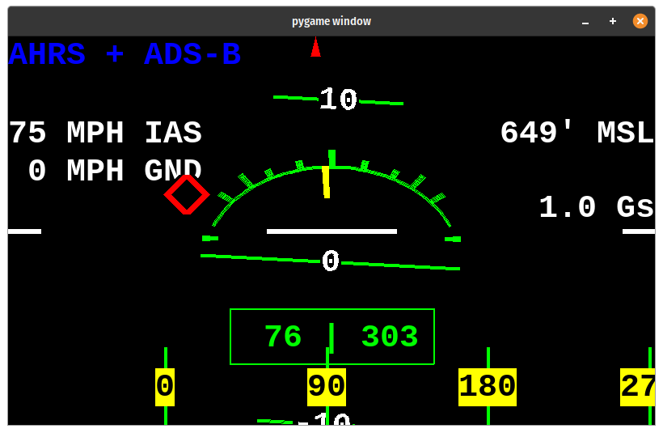
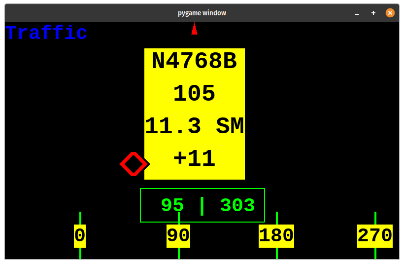
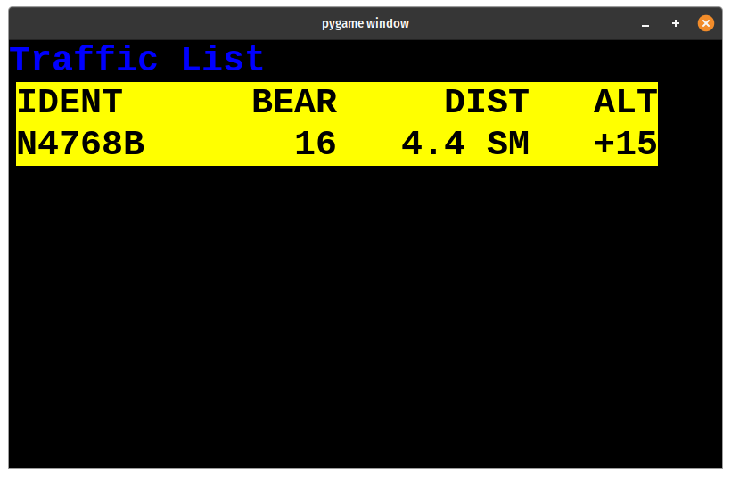
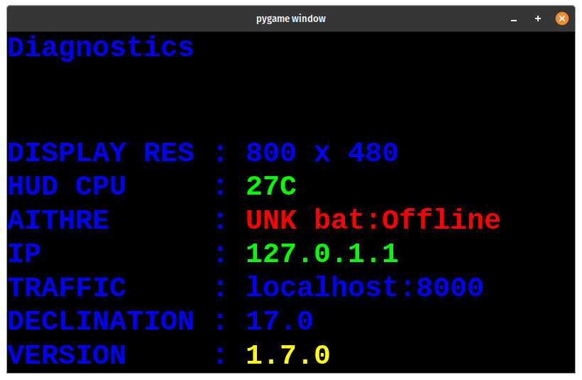
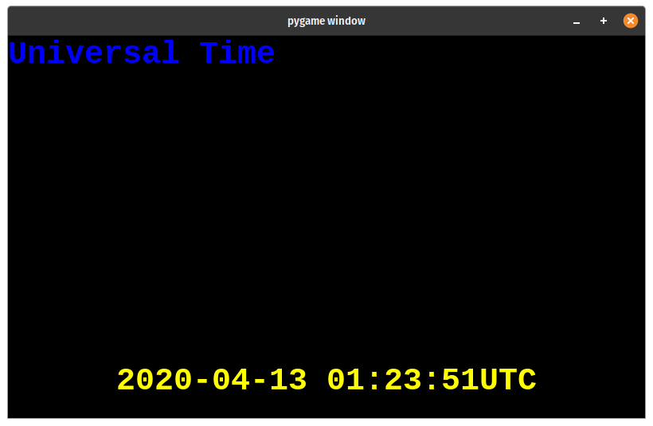
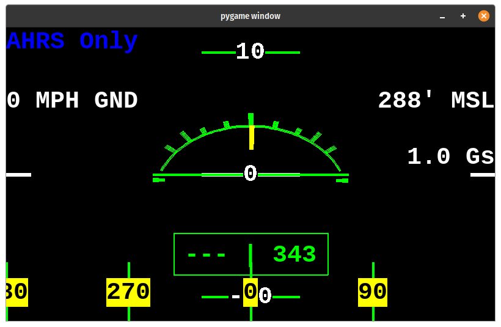
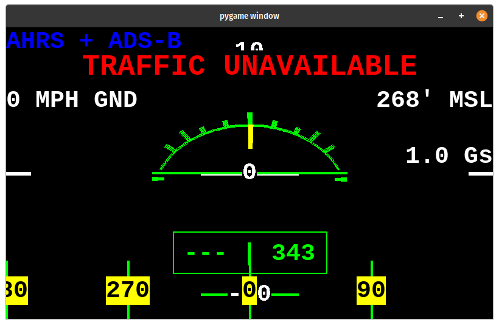
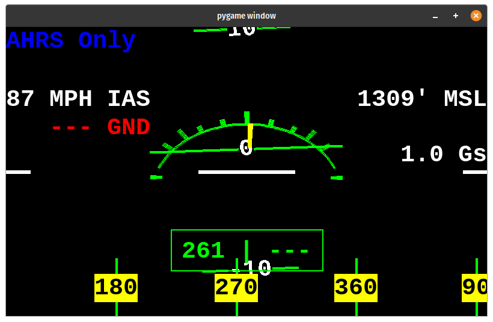

# STRATUX HUD

## 1 Table of Contents

[[TOC]]

## 2 Introduction

This project aims to bring an affordable heads up display system into ANY cockpit.

The focus is to improve traffic awareness and to reduce the amount of time pilots reference tablets or an EFB.

**NOTE:** This project relies on having a [Stratux](http://stratux.me/) build with AHRS and GPS. A suitable build can be done for less than \$150 (USD).

There are two versions that can be built:

### 2.1 Configurations

There are two main ways to configure the StratuxHud.

The first is as a stand-alone unit. For the standalone configuration, the HUD code runs on its own Raspberry Pi.

The second is in an "All-In-One" (AIO) configuration. With an AIO setup, the HUD code runs on the Stratux.

| Feature                    | Stand Alone | AIO          |
| -------------------------- | ----------- | ------------ |
| Keypad Control             | Yes         | No           |
| Dynon D180 Support         | Yes         | No           |
| Aithre CO Monitor          | Yes         | Experimental |
| Illyrian SPO/Pulse Monitor | Yes         | Experimental |
| Raspberry Pi 3b+           | Yes         | No           |
| Raspberry Pi 4             | Yes         | No           |

### 2.2 Recommended Projector

Using the "Kivic HUD 2nd Gen" projector and a Raspberry Pi 3.


Estimated cost is \$240

- \$45 for RaspberryPi 3b+
- \$195 for Kivic 2nd Gen projector
- Fans, case, cables

Uses 5V USB power.

**NOTE:** This project initially used and recommended the "HUDLY Classic" projector which is no longer available.

### 2.3 Recommended Stratux Configuration

To get the most out of the StratuxHud, the following configuration for the Stratux is suggested:

- V3 receiver for 978 (UAT)
- V2 receiver for 1090
- Stratux GPYes u-blox 7

Picking the correct GPS solution for your HUD can be difficult.

The Vk-162, while less tidy due to the cable, has FAR superior GPS reception.
GPS reception with the GP-Yes unit can be a problem.

I have two two Vk-162 units fail. With each failure the AHRS reports from the Stratux have been VERY slow.

This behavior has not been observed with a GPYes unit.

If you are running the HUD as a standalone unit AND using the optional Dynon interface, then this is not a problem.

For the StratuxHud to work correctly, you MUST have the AHRS chip and a GPS solution installed on the Stratux

**NOTE:** To have full functionality with a Stratux based unit, please use Stratux Version 1.6r1 or higher.

### 2.4 Dynon Integration

New with v1.7 is integration with Dynon D10/D100 Series Products.

This is achieved using the serial output.

At this time, integration with a Dynon D180 has only been tested.

The DynonToHud service is included with the Stand Alone image of the StratuxHud.

While the DynonToHud service does decode and make available both the EFIS and EMS data, at this time only the EFIS/AHRS data is presented by any of the HUD views.

For more information on the setup, and installation of the DynonToHud service, please visit the project page.

(DynonToHud)[<https://github.com/JohnMarzulli/DynonToHud>]

## 3 In-Flight Controls

You may use a number pad as an input device. I used velcro to secure the number pad to my dashboard.

| Key       | Action                                                                       |
| --------- | ---------------------------------------------------------------------------- |
| Backspace | Tell the Stratux that you are in a level position. Resets the AHRS to level. |
| +         | Next view                                                                    |
| -         | Previous view                                                                |
| =         | Toggle rendering debug information                                           |
| Esc       | Send shutdown commands to both the HUD controller **and** the Stratux        |
| q         | (_Full keyboard only_) Quit to the command line.                             |
| 0/Ins     | Force a connection reset between the HUD and the Stratux                     |

## 4 Included (Default) Views

- AHRS + ADS-B
- Traffic
- Traffic List
- Universal Time
- Diagnostics
- (Blank)
- AHRS Only

### 4.1 AHRS + ADS-B View



This view shows attitude information along with targeting bugs that show the relative position and distance of traffic.

In this example:

- There is one (1) potential target. The traffic is at a higher altitude, and somewhat distant.
- The traffic is within our field of view and has a targeting reticle.
- With are rolled to the left slightly, less than 10 degrees.
- We are at 649 feet MSL.
- We have an indicated AIRSPEED of 75MPG, but are hovering with a groundspeed of 0MPH
- We have a heading of 76, but our GPS track is 303\. If the AHRS or GPS is unable to obtain a reliable heading then `---` is shown for that portion of the heading.

_NOTE:_ This example was using EFIS/AHRS data obtained from a Dynon D-180 FlightDek. As a result, **I**ndicated **A**ir **S**peed (IAS) is displayed. The heading of 76, G-Force of 1.0, and altitude of 649' are also sourced from the Dynon.

_NOTE:_ This is the default view on startup. If you would like to switch to the `AHRS Only` You may press `-` on the keypad.

### 4.2 Traffic View



This view shows a heading strip, target bugs, targeting reticles, and "information cards" about our potential traffic.

In this example, `N4768B` is almost directly in front of us. The plane is 11.3 statute miles away, with a bearing of 105 degrees, and 1,100 feet above us.

Note that the bearing is calculated using the direction we are pointing (left side heading), **NOT** the ground track heading which is the right portion.

### 4.3 Traffic Listing View



This shows us _at most_, the eight closest planes.

The \_IDENT_ifier will be the tail number when available, otherwise, the ICAO identifier or callsign may be used. The \_BEAR_ing is the heading to take to fly to that target. The \_DIST_ance is the distance to the target. The \_ALT_itude is given in relative terms, with two digits dropped.

In this example, the closest target is N4768B. The plane is only 4.4 statue mile away, and 1,500 feet above us.

### 4.4 Diagnostics View



The diagnostics view is designed to help give some troubleshooting ability. If a value is set for "OWNSHIP" (See the configuration file section), then any report from that tailnumber is ignored. The IP address is provided so you may use the configuration webpage if you set it up.

This view also tells you how hot the HUD processor is with the `HUD CPU` row (temperature is in Celsius). The Aithre row tells you information about any Aithre or Illyrian sensors attached. The Traffic row tells you the address that the HUD is using to contact the TrafficManager service. If you see a "TRAFFIC UNAVAILABLE" warning, this address is critical to resolving your issue.

### 4.5 Universal Time



Shows the current time in UTC at the bottom of the screen.

### 4.6 Blank

A blank screen so no information is displayed.

### 4.7 AHRS View



This is a similar view to `AHRS + ADS-B`, but removes any AHRS information.

Here you can see that only the Stratux is being used for flight data. As a result only the Ground Speed is available.

The unit was not moving at the time, so the heading was not available, but the ground track was 343.

### 4.8 Traffic Unavailable Warning



This view element appears when the HUD software is unable to communicate with the "TrafficManager" service.

This sub-service handles the communication of traffic data with the Stratux receiver.

If you see this warning, the service has stopped, was not installed correctly, or the HUD is looking for it in the wrong place.

If this warning appears sometime during the flight, and is not always on, then a HUD restart may resolve the issue.

Please note that the warning DOES not appear on the "AHRS Only" view.

### 4.9 AHRS Only With Only Dynon



If you are using the DynonToHud service, then it is possible to run the StratuxHud without a Stratux.

When you do this, traffic and GPS based data will not be available.

Here you can see the Ground Speed (GND) read "---" and is colored red to indicate the data is not available. The ground track also reads "---"

_NOTE:_ If you are using the DynonToHud service AND the Stratux is unable to gain or keep GPS lock, then this is what will appear. The ground speed and ground track will re-appear when GPS lock is re-obtained. _NOTE:_ Positioning of your GPS antenna, or flight maneuvers that cause the antenna to no longer have a view to the sky may cause GPS lock to be lost.

## 5 Parts List

### 5.1 All Builds

_NOTE:_ This _does not_ include a power source. You will need to supply ship power from a 5V USB port or from a battery. _NOTE:_ This is for a build that uses a separate Raspberry Pi to drive the display. If you wish to have an "All-In-One" solution where the HUD software runs on the Stratux, you will not need an additional Pi.

- [Aviator Systems Display](https://shop.aviatorsys.com/product/stratux-hud/) Choose "HUD Standalone"
- [_OPTIONAL_ 3/4" Wire Braiding](https://www.amazon.com/gp/product/B073YL3HMC/ref=ppx_yo_dt_b_asin_title_o00_s01?ie=UTF8&psc=1)

### 5.2 Recommended Stand Alone Build

- [Raspberry Pi 3B+](https://www.amazon.com/ELEMENT-Element14-Raspberry-Pi-Motherboard/dp/B07P4LSDYV/ref=sr_1_6?dchild=1&keywords=raspberry+pi+3B%2B&qid=1586751198&sr=8-6)
- [Case For Raspberry Pi](https://www.amazon.com/iPhoenix-Raspberry-White-Compatible-Model/dp/B06XQSXZ97/ref=sr_1_3?s=electronics&dd=iYEspjjyeRXfqDW9BHwJFw%2C%2C&ddc_refnmnt=pfod&ie=UTF8&qid=1529215794&sr=1-3&keywords=white+raspberry+pi+3+case&refinements=p_97%3A11292772011)
- [Cooling Fan for Raspberry Pi](https://www.amazon.com/gp/product/B075R4S9GH/ref=od_aui_detailpages00?ie=UTF8&psc=1)
- [Micro USB Cable](https://www.amazon.com/AmazonBasics-Male-Micro-Cable-Black/dp/B0711PVX6Z/ref=sr_1_6?s=electronics&ie=UTF8&qid=1529215888&sr=1-6&keywords=micro+usb+cable)
- [Micro SD Card](https://www.amazon.com/SanDisk-Ultra-Micro-Adapter-SDSQUNC-016G-GN6MA/dp/B010Q57SEE/ref=sr_1_10?s=pc&ie=UTF8&qid=1529215944&sr=1-10&keywords=micro+sd+card)
- [Rottay Mechanical Keypad](https://www.amazon.com/Number-Rottay-Mechanical-Numeric-backlit/dp/B076FTSY6J/ref=sr_1_3?ie=UTF8&qid=1529215627&sr=8-3&keywords=mechanical+keypad)

## 6 Recommended Software Install

Please use one of the provided images from the "Release" page on GitHub.

1. Download the image for your scenario from the GitHub (Releases Page)[<https://github.com/JohnMarzulli/StratuxHud/releases>]
2. Use (Etcher)[<https://www.balena.io/etcher/>] to flash the image onto a Micro SD card.
3. Plug in your Projector to the Raspberry Pi
4. It is recommended that you SSH into the HUD and use `raspi-config` to ("expand the filesystem")[<https://geek-university.com/raspberry-pi/expand-raspbian-filesystem/>].

## 7 Development/From Scratch Install instructions

### 7.1 First Boot

1. Flash the latest [Raspbian](https://www.raspberrypi.org/downloads/raspbian/) to an SD card
2. Plug in a keyboard and a monitor
3. Plug in the power to the Pi.
4. Press ctrl+alt+f1 to quit from the GUI to the desktop
5. `sudo raspi-config`
6. `Boot Options` -> `Desktop / CLI` -> `Console Autologin`
7. `Advanced Options` -> `Expand Filesystem`
8. `Advanced Options` -> `Memory Split` -> "128"
9. "OK"
10. "Finish"
11. "Yes"
12. Wait for the reboot
13. `sudo raspi-config`
14. "Network options" -> "WiFi"
15. Choose your country. Pressing "u" will take you to USA.
16. Enter your network name and password.
17. "Interfacing Options" -> "Enable SSH"
18. "Localization" -> "Change Keyboard Layout" -> "Generic 104"
19. "Other" -> "English US" -> "Default" -> "No compose" -> "Yes"
20. "Finish"

#### 7.1.1 Raspberry Pi 3B+

If you are using a 3B+, and are experiencing under-voltage warnings, these may be relieved by the following command to update your Linux install to the latest:

```bash
sudo apt-get update && sudo apt-get dist-upgrade -y
```

Other causes of under-voltage warnings are low-quality USB cables, lose power port on the Pi, or a low quality power supply.

Make sure you are using a high-quality power cable if you are using a Pi 3B+

### 7.2 Install Software

1. Enter `ping google.com`. Press ctrl+c after a while. This will confirm that you have internet access. If you do not, then use rasp-config to re-enter your wi-fi
2. `cd ~`
3. `git clone https://github.com/JohnMarzulli/StratuxHud.git`
4. `cd StratuxHud`
5. `sudo apt-get install libgtk2.0-dev` a. Choose `Y` if prompted
6. `cd tools; ./install_splash.sh`
7. `python --version`. Verify that your version is 2.7.14
8. `sudo python3 setup.py develop` For Linux systems where you wish to develop or debug: `sudo setcap 'cap_net_raw,cap_net_admin+eip' ~/.local/lib/python2.7/site-packages/bluepy/bluepy-helper`
9. `sudo raspi-config`
10. Choose "WiFi" again, and enter `stratux` as the SSID. No password.
11. `sudo vim /etc/wpa_supplicant/wpa_supplicant.conf`
12. Delete the section that contains your WiFi network, leaving the section that contains the Stratux network.
13. More info on configuring Linux WiFi: <https://www.raspberrypi.org/forums/viewtopic.php?t=160620>
14. Save and quit.
15. Type "crontab -e"
16. Select "Nano" (Option 1)
17. Enter the following text at the _bottom_ of the file:

```bash
@reboot sudo python3 /home/pi/AithreToHud/aithre_manager.py &
@reboot nodejs       /home/pi/TrafficToHud/build/traffic_manager.js &
@reboot python3      /home/pi/DynonToHud/dynon_to_hud.py &
@reboot sudo python3 /home/pi/StratuxHud/stratux_hud.py &
@reboot nodejs       /home/pi/HudConfig/build/index.js &
```

1. Save and quit.

#### Alternative

Use LXDE autostart:

https://www.raspberrypi.org/forums/viewtopic.php?t=275703

#### 7.2.1 Developer Note

To ensure proper operation, if you are a developer the order services are brought online is important.

The following order is suggested:

1. Stratux
1. AithreManager
1. DynonToHud
1. TrafficManager
1. StratuxHud
1. HudConfig

The AithreManager has no external dependencies.

The DynonToHud service has no external dependencies.

The TrafficManager uses the Stratux ADS-B services and received.

The StratuxHud depends on the AithreManager and the TrafficManager. It can optionally use DynonToHud.

The HudConfig depends on the StratuxHud

#### 7.2.1 Upgrading From v1.7

If you are compiling from source code and upgrading from V1.7, some additional steps will need to be taken.

First, you will need to delete all .pyc files.
It is also reccomended that you delete the `__pycache__` directory.
The `traffic manager`, `node_modules`, `lib`, and `aithre_manager` directories are no longer used and should be removed.

### 7.3 Ownship

You may have the HUD ignore your own aircraft using a "OWNSHIP" functionality. The OWNSHIP value is set using the Stratux. The HUD retrieves the Mode S code set as the OWNSHIP and then filters out all reports so they are ignored.

Please refer to the Stratux documentation on how to set the OWNSHIP value.

### 7.4 Aithre Support

Support for Aithre was added in V1.5

Values for the CO PPM are shown in the default `AHRS Only`, `AHRS + ADS-B`, and `System Information` views.

No additional setup is required, just simply turn on your Aithre and place it within range of the StratuxHud processing unit.

NOTE: Aithre support will only work on Raspberry Pi units that have a Bluetooth chip, such as the 3, and 3B+. The RPi2 and earlier will not work.

NOTE: The Aithre hardware supports only a single device at a time. If you wish to use the phone app to display your CO PPM values:

1. Use the HudConfig tool to disable Aithre support

Alternatively:

1. Open `/root/hud_config.json`
2. Set the "aithre" line to: `"aithre": false,`
3. Save and close.

#### 7.4.1 BlueTooth for AIO Setups

**EXPERIMENTAL**

For All In One (Stratux + HUD on the same machine) setups, additional steps need to be taken.

Due to the needs of the GPS, the normal BlueTooth functions are disabled. Edit the /boot/config.txt to include the following line **beneath** the line that sets the overlay to value of `dtoverlay` to "miniuart".

```
enable_uart=1
```

Edit the line towards the bottom to have `core_freq=250`

More details on Pi3 Bluetooth can be found here: <https://www.cnet.com/how-to/how-to-setup-bluetooth-on-a-raspberry-pi-3/>

_**Warning**_

It has been found that enabling BlueTooth and the GPS simultaneously can cause hardware instability. This needs to be considered an experimental feature and only used if you are willing to potentially lose the Stratux during flight.

### 7.5 Kivic Based Setup

1. Install the Kivic projector per the Kivic directions. Please note that there is a release clip and the unit is removable. Also note that the combiner glass can be adjusted fore and aft.
2. Plug in the 3.5mm TRS cable between the Raspberry Pi and the Kivic. This is the same hole as the audio adapter for the Pi.
3. Plug the number pad into the Raspberry Pi.
4. You will need to run two Micro USB (5v) power cables. One to the HUD and one to the Raspberry Pi processing unit. These may be run from a battery bank, or from the ship's power **if** you have 5V USB outlets.
5. You may use the _optional_ sleeving to help keep the install tidy.

## 8 Appendix

### 8.1 Updating StratuxHud Code

If you would like to update from an earlier version to V1.5

1. Connect to a network using the ethernet cable.
2. Connect your Pi to a monitor using an HDMI cable. Connect a keyboard.
3. Reboot.
4. Press "Q" while the HUD is running to quit to a command line.
5. cd /home/pi/StratuxHud
6. `git fetch`
7. If you are currently running a version earlier than 1.5 _only_: `sudo cp *.json /root/`
8. `git stash`
9. `git checkout master`
10. `git pull`
11. If you have any errors, please report them immediately. Otherwise you are updated.
12. `sudo shutdown -h now`

### 8.2 Barrel Jack Connector (Raspberry Pi 3 only _**NOT 3B+**_)

You may consider using a barrel jack connector to supply power to your Pi unit.

These connectors are more durable than the Micro USB connector on the board, or are a good repair if your connector becomes damaged.

- [Barrel Jack (Female) To Wire Adapter](https://www.amazon.com/gp/product/B00QJAW9F4/ref=ppx_yo_dt_b_asin_title_o00_s00?ie=UTF8&psc=1)
- [USB A to Barrel Jack Plug (Male)](https://www.amazon.com/Onite-5-5x2-1mm-Positive-Electronic-Organorgan/dp/B01MZ0FWSK/ref=sr_1_1?keywords=Usb+2.0+a+to+5.5%2F2.1mm+Barrel+Connector+Jack+Dc+Power+Cable&qid=1567660324&s=gateway&sr=8-1)

You will find the solder pads on the bottom of the Raspberry Pi 3, near the Micro USB power Jack.

- Solder +5V (Red) to PP2
- Solder GND (White) to PP3

### 8.3 Revision History

| Date       | Version | Major Changes                                                                                                                                                                                                                                                                                                                                                                                                                                                                                                                                                                                                                                                                                                                                 |
| ---------- | ------- | --------------------------------------------------------------------------------------------------------------------------------------------------------------------------------------------------------------------------------------------------------------------------------------------------------------------------------------------------------------------------------------------------------------------------------------------------------------------------------------------------------------------------------------------------------------------------------------------------------------------------------------------------------------------------------------------------------------------------------------------- |
| 2020-10-31 | 2.0     | Migration to Python V3, with major refactoring of underlying code. New TopDownScope element and view.                                                                                                                                                                                                                                                                                                                                                                                                                                                                                                                                                                                                                                         |
| 2020-04-20 | 1.7     | Now able to cycle through views using the HudConfig page. Support for Illyrian by Aithre. Split Aithre data collection into a micro-service. Improve warning on some elements when GPS lock is lost. Fix user configuration files not always being used or saved. Support new V3 radio and Stratux 1.6\. Experimental support for Aithre in Stratux + HUD AIO configurations. Updates to distance conversion. Use the same naming strategy for aircraft as popular EFBs. Support data collected from Dynon serial output using the DynonToHud project. Indicate which speeds are IAS and groundspeed when GPS and Avionics data are both available. Update element positions. Added new indication when the Traffic service is not available. |
| 2019-09-04 | 1.6     | Traffic manager moved to a stand-alone service in NodeJs/TypeScript.                                                                                                                                                                                                                                                                                                                                                                                                                                                                                                                                                                                                                                                                          |
| 2019-06-30 | 1.5     | Support for the Aithre CO detector. New roll indicator. Various performance improvements. Visual warning if GPS is not plugged in. Use the OWNSHIP config from the receiver instead of the local config.                                                                                                                                                                                                                                                                                                                                                                                                                                                                                                                                      |
| 2019-03-31 | 1.4     | Add connection reset button. Fixes issues with the Diagnostic view running out of space. Initial port to Python 3.7                                                                                                                                                                                                                                                                                                                                                                                                                                                                                                                                                                                                                           |
| 2019-01-31 | 1.3     | Improvements to the communication with the Stratux. Update directions for Kivic install.                                                                                                                                                                                                                                                                                                                                                                                                                                                                                                                                                                                                                                                      |
| 2018-10-13 | 1.2     | Major performance increases                                                                                                                                                                                                                                                                                                                                                                                                                                                                                                                                                                                                                                                                                                                   |
| 2018-09-07 | 1.1     | New system to allow views to be configurable                                                                                                                                                                                                                                                                                                                                                                                                                                                                                                                                                                                                                                                                                                  |
| 2018-07-17 | 1.0     | Initial release                                                                                                                                                                                                                                                                                                                                                                                                                                                                                                                                                                                                                                                                                                                               |

### 8.4 Hardware Performance

Please note that performance characteristics are only shown for displays that are currently available for purchase. The Hudly Classic is intentionally not listed.

| Board                          | Screen         | Frames Per Second (AHRS View Only) | Notes              |
| ------------------------------ | -------------- | ---------------------------------- | ------------------ |
| Rasp Pi 2 (stand-alone)        | Sun Founder 5" | ~25FPS to ~30FPS                   | Not recommended    |
| Rasp Pi 3 (stand-alone)        | Kivic          | 50FPS - 60FPS                      | Recommended        |
| Rasp Pi 3 (stand-alone)        | Hudly Wireless | 30FPS - 50FPS                      | Recommended        |
| Rasp Pi 3 (Running on Stratux) | Kivic          | 30FPS                              | Highly Recommended |
| Rasp Pi 3 (Running on Stratux) | Hudly Wireless | 25FPS                              | Highly Recommended |
| Rasp Pi 3B+ (stand-alone)      | Kivic          | 55FPS - 60FPS                      | Recommended        |
| Rasp Pi 3B+ (stand-alone)      | Hudly Wireless | 40FPS - 60FPS                      | Recommended        |
| Rasp Pi 4 (stand-alone)        | Kivic          | 60FPS                              | Highly Recommended |
| Rasp Pi 4 (stand-alone)        | Hudly Wireless | 60FPS                              | Highly Recommended |

Please note that the frame rate is capped at 60FPS. Drawing any faster will not be detectable using the recommended output systems. Reducing the framerate will reduce the powerdraw.

## 9 Acknowledgements And Credits

This project uses the Liberation family of fonts. They can be found at <https://pagure.io/liberation-fonts/>

The initial project was inspired by Kris Knigga's PyAhrs project <https://github.com/kdknigga/pyahrs>

Many thanks to the Aithre team for providing the unit used to develop the plugin, and for their support in understanding the Aithre interface.

The following components are used:

- Python
- PyGame

... and of course Stratux

## 10 License

This project is covered by the GPL v3 license.

[](https://www.gnu.org/licenses/gpl-3.0)

## NOTES

- Python 3.9 introduces issues with `isAlive`
- PyGame 1.9.6 is the last known working version. v2.0 instroduces issues with window creation.

## AIO Jessie Install

```bash
cd ~
wget https://www.openssl.org/source/openssl-1.1.1g.tar.gz
tar zxvf openssl-1.1.1g.tar.gz
cd openssl-1.1.1g
./config --prefix=/home/pi/openssl --openssldir=/home/pi/openssl no-ssl2
make
make install

cd~
wget https://www.python.org/ftp/python/3.8.8/Python-3.8.8.tgz
sudo tar zxf Python-3.8.8.tgz
cd Python-3.8.8
export LD_LIBRARY_PATH=${LD_LIBRARY_PATH}:/home/pi/openssl/lib/
sudo ./configure --enable-optimizations  --with-openssl=/home/pi/openssl/
sudo make
sudo make install
```

```bash
sudo apt install libsdl-mixer1.2-dev
sudo apt install libsdl2-ttf-dev libsdl2-mixer-dev libsdl2-image-dev libsdl-sound1.2-dev python3-pygame

pip3 install setuptools
sudo python3 setup.py develop
pip4 install pygame==1.9.6
```

## OpenGl

sudo apt install freeglut3 freeglut3-dev

pip3 install PyOpenGL PyOpenGL_accelerate

https://www.raspberrypi.org/forums/viewtopic.php?t=223592
https://www.raspberrypi.org/forums/viewtopic.php?t=243892
https://www.raspberrypi.org/forums/viewtopic.php?t=266277

## 11 Roadmap

- Dynon Skyview support
- Airball support
- Engine instruments and displays
- Weather
- Audio alerts
- Turn "projection" on the radar map.
- Nearby airports
- View improvements
